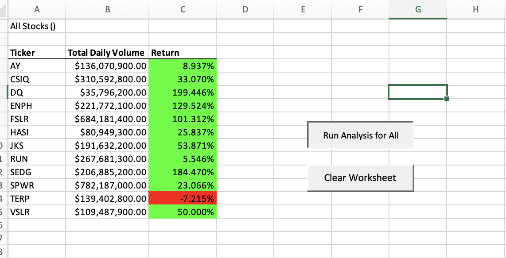

# Stock Analysis Module 2 Challenge

## Overview of Project:
In this project, our client Steve asked us to prepare a workbook for him to analyze Stock Market data to determine each stock's Total Daily Volume and their Return %. This will help Steve to determine the right stocks to recommend to his parents that are looking to invest. We took the inital data set provided in Excel and used VBA to create an efficient, user-friendly workbook for our client to be able to easily click a button and enter the year and then have the workbook quickly display the results. 

## Results
### **Stock Performance 2017 vs 2018**
When analyzing the performance of the stocks in 2017 versus 2018, there is a significant change in the returns on the stocks in 2018 than in 2017. In 2017, all except one of the stocks (TERP) has a positive return for the year in terms of Total Daily Volume. But in 2018, only two stocks had a positive return (ENPH and RUN). The remaining 10 stocks had a negative return. 

#### **2017 Results**

#### **2018 Results** 

### **VBA Code Analysis**

In order to create the analysis tables in Excel to provide to Steve, our client, we started off setting our variables to allow us to later loop through the data in order to find the Total Daily Volume and ultimately the Return %. 

We created a for loop to add the ticker volumes for each day and looped through all of the starting and ending prices until a new ticker appeared in the first column which at this point goes to the next ticker and repeats. 

We end by outputting the Ticker Name, Volume and Return % and then format the table to display the results. Finally the timer appears and shows how long it took to run the code. 

## Summary
### **Advantages and Disadvantages of Refactoring Code**

There are many advantages to refactoring code and I think the biggest one is that there are many different ways to get the same outcomes through our codes in VBA but some may take significant time to produce a results whereas other code may be much more efficient in getting to the same answer. By reviewing code and refacotring it, we can analyze the logic that was used to produce the end result and then determine if there is a more effificent way that the code can be written to get the results faster or it might help us to relize that although the code worked, the logic may have been flawed. By reviewing code - it helps to determine if any errors were involved that caused data to get manipulated in a way that would skew the results. The only disadvantage that I can see in refactoring code is by trying to clean up the code and make it more efficient, you might end up changing the code too much that it creates additional problems when it comes to the outputs. Human error can be eliminated but by spending too much time refactoring it, it can also allow for more human error to be introduced into the process. 

### **Advantages and Disadvantages of the Original VBA and the Refactored VBA**

The biggest advantage of the refactored VBA script versus the original is that it ran significatly faster by only reviewing the code for each ticker to get the volumes instead of the original code that reviewed every line of the code for each iteration causing it to significantly increase the time to solve. By refactoring the code, we were also able to clean  up the language and flow of the script which made it much easier to understand the logic we were using in order to find the Volume and Return % for each of the 11 ticker stocks. The disadvantage that I came across while refactoring the code was that in the process of trying to improve the code, I got too wrapped up in chnaging the code to improve efficiency that I ended up creating many more bugs that I had to work through and it caused me to second guess the logic I was using. 